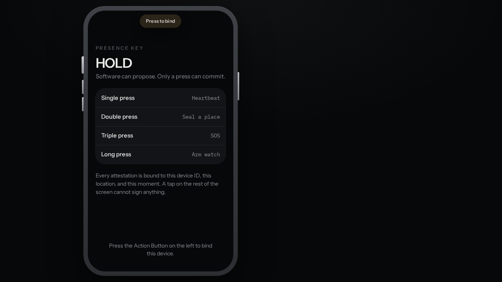
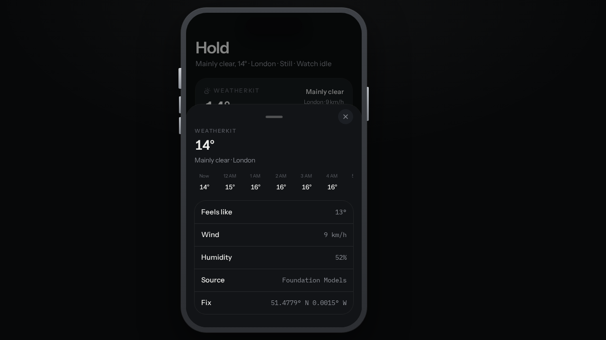
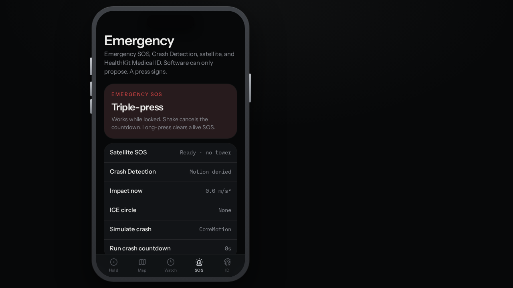
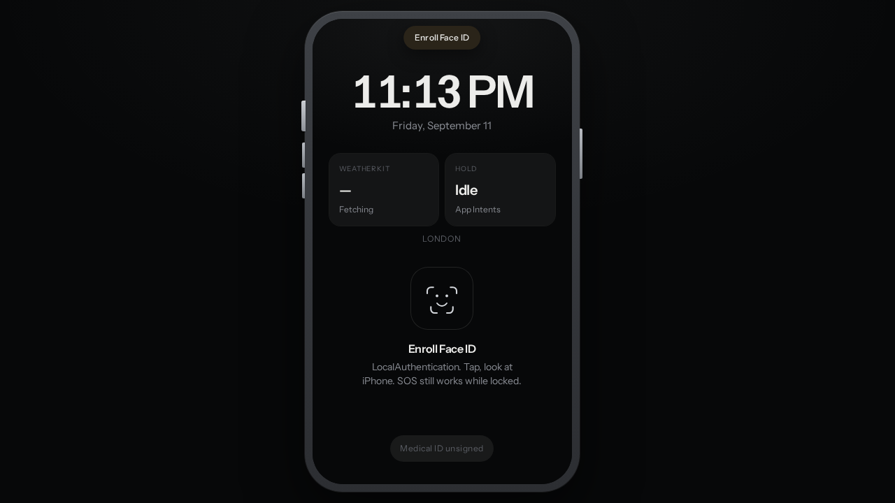
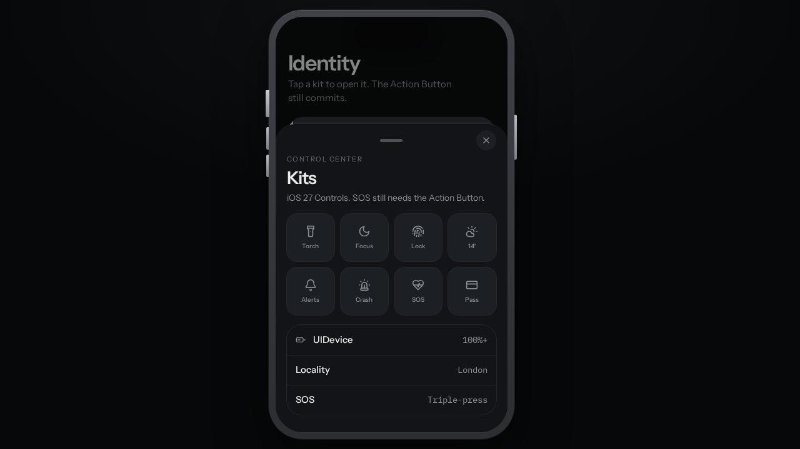
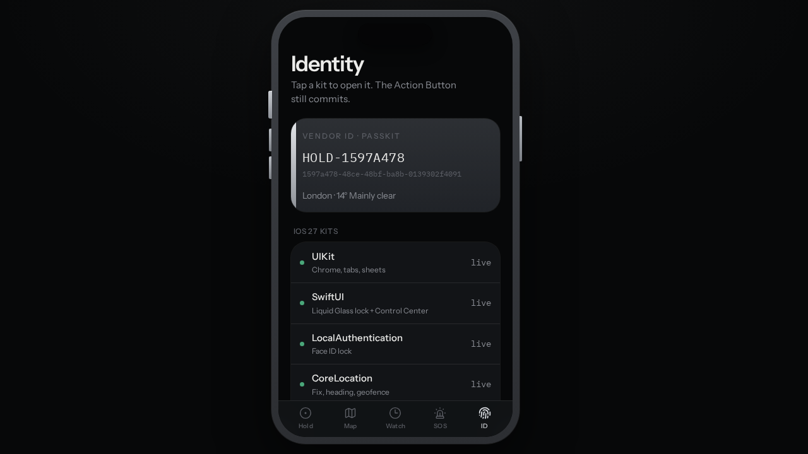

# HOLD

**Personal presence OS for iPhone.**  
Software can propose. Only the Action Button can commit.

HOLD treats the physical Action Button as a root of trust — the same idea as Apple Pay for *presence*. A software tap never signs a heartbeat, never seals a place, never arms Watch, never fires Emergency SOS, never enrolls Face ID. Those actions exist only as hardware gestures.

This repository is a high-fidelity **iOS 27** simulation of that product: UIKit chrome, Liquid Glass lock and Control Center, live kit surfaces, and real device sensors in the browser. It is also the specification for a future native Xcode app.

---

## Why HOLD exists

iPhone already has the sensors. What it does not have is a single, hardware-backed primitive that means *I am here, I am OK, and I meant this*.

HOLD is that primitive.

| Gesture | Commit |
| --- | --- |
| **Single press** | Heartbeat — sign location, weather, battery, heading, motion |
| **Double press** | Seal a Place — geofence this fix |
| **Triple press** | Emergency SOS — works while locked |
| **Long press** (1.5 s) | Arm / disarm Watch (dead-man's switch) |
| **Shake** | Cancel SOS or crash countdown |
| **Side button** | Lock (Face ID required to return) |

Face ID **unlocks**. It never **signs**. Unlocking is not attestation.

---

## Try it

1. Open the live preview (or run locally, below).
2. Press the **Action Button** on the left of the phone (or **Space** on a keyboard) to bind this device.
3. Press again to enroll **Face ID**. The lock screen is the home of WeatherKit, Medical ID, ActivityKit, and Control Center.
4. After unlock, the Hold dashboard is the kit OS — weather, map, health, emergency, Face ID, Live Activity, PassKit.
5. Triple-press from anywhere, including lock, to start SOS. Shake to cancel. Long-press to clear a live SOS.

Keyboard (desktop preview):

| Key | Hardware |
| --- | --- |
| Space / Enter | Action Button |
| S | Shake |
| Side button (right bezel) | Lock |

If GPS is unavailable, HOLD binds a **Greenwich Lab** fix so the whole ecosystem still plays.

<p align="center">
  
  
  
</p>
<p align="center">
  
  
  
</p>

---

## Current functionality

HOLD is not a kit list. Every Apple surface is a live, tappable product.

### Presence

- Device bind issues a vendor-style identity (`HOLD-XXXXXXXX`).
- Every press writes an **attestation**: lat/lng, accuracy, heading, speed, battery, motion, weather, locality, place, device id, timestamp.
- Log is append-only (capped). Nothing is edited after the press.
- Heartbeat during severe weather becomes a **weather acknowledgement**.

### Lock, Face ID, widgets

- Lock Screen: clock, WeatherKit widget, HOLD Live Activity, Medical ID pill, Face ID ring.
- Face ID auto-scans when enrolled. Medical ID is readable **without** unlocking.
- Control Center grabber at the top of lock — torch, Focus (Off / Sleep / Work), battery, brightness, identity.
- Side button locks. Torch and Sleep Focus restyle the phone chrome.

### Kits as surfaces

| Kit | What you actually use |
| --- | --- |
| **WeatherKit** | Lock widget + Hold hero + hourly strip + weather sheet. Signed into every heartbeat. Severe weather must be acknowledged by press. |
| **MapKit / CoreLocation** | Dark map, sealed Places as pins, radar with true-north heading, compact map on Hold. |
| **LocalAuthentication** | Face ID enroll (Action Button) and unlock. Never a substitute for a press. |
| **Emergency SOS** | Triple-press countdown (5 s). Shake to cancel. Long-press to clear. Works locked. Satellite SOS copy. ICE contacts. |
| **Crash Detection** | High-g from CoreMotion (or Simulate). 8 s “press if you’re OK”. Expire → SOS. |
| **HealthKit** | Medical ID (name, blood, allergies, notes). Draft in software; **press to sign**. Shown on lock. |
| **ActivityKit** | Dynamic Island + lock Live Activity for Watch / SOS / crash. |
| **WidgetKit** | Lock weather + HOLD activity. |
| **UserNotifications** | Watch-due and weather alerts (browser Notification API). |
| **PassKit** | HOLD credential sheet — the presence pass. |
| **Focus** | Sleep / Work from Control Center. |
| **CoreHaptics** | Distinct patterns for down, heartbeat, success, error. |
| **UIDevice** | Battery signed on every press. |
| **Contacts** | Circle / ICE. Adding a contact is proposed in software, committed by press. |
| **AppIntents** | The four Action Button gestures. |
| **Foundation Models** | On-device situation line from weather + locality + motion + watch. |
| **UIKit / SwiftUI** | Grouped lists, tab bar, sheets, Liquid Glass lock and Control Center. |

### Watch

Dead-man's switch. Arm with a long press. Interval 1 / 5 / 15 / 30 minutes (interval change is **pending** until the next press). Miss a heartbeat and HOLD treats you as overdue.

### Places

Double-press to seal the current fix as a named geofence. Later heartbeats resolve “at Home”, “at Work”. Radar shows heading and distance.

### Identity

Vendor ID, Face ID lock, kit matrix (every row launches the real surface), lab-fix toggle, sensor permissions.

---

## Architecture

```
src/
  components/hold/     UIKit-style screens, lock, sheets, overlays
  lib/hold/
    store.ts           Zustand persist (hold.v2) — attestations, watch, SOS, Face ID
    sensors.ts         Geolocation, DeviceMotion, orientation, Battery, vibration
    world.ts           WeatherKit stand-in (Open-Meteo) + reverse geocode
    use-action-button  340 ms multi-click / 1500 ms long-press recognizer
    kits.ts            iOS 27 kit catalog and dispatch
    types.ts           Attestation, Place, Medical ID, phases
```

**Rule of the store:** `handlePress` is the only commit path. Sheets, tabs, and forms may *propose* (`pending`). A press *commits*. Crash-OK and SOS work while locked; everything else is gated on Face ID.

Sensor mapping (web → native):

| Browser | iOS |
| --- | --- |
| Geolocation | CoreLocation |
| DeviceMotion | CoreMotion (shake, crash) |
| DeviceOrientation | True-north heading |
| Battery Status | UIDevice |
| Vibration | CoreHaptics / UIFeedbackGenerator |
| Notification | UserNotifications |
| localStorage (Zustand persist) | Keychain + SwiftData |

Weather uses [Open-Meteo](https://open-meteo.com) and reverse-geocodes with BigDataCloud. If the network or GPS is missing, a model forecast and Greenwich Lab keep the product playable.

---

## Run locally

```bash
npm install
npm run dev          # http://localhost:8080
npm run typecheck
npm run build
```

Stack: React 19, TanStack Start, Zustand, Tailwind 4, Vite.

Install to the iPhone home screen from Safari (Add to Home Screen) for the closest-to-native feel: Action Button hit target, sensors, and haptics all work on-device.

---

## Native target (iOS 27 / Xcode)

This web app is the product spec. The intended shipping form is a UIKit + SwiftUI app whose *only* commit surface is the hardware Action Button.

| HOLD surface | Native framework |
| --- | --- |
| Chrome, tabs, grouped lists | UIKit |
| Lock, Control Center, sheets | SwiftUI + Liquid Glass |
| Action Button gestures | App Intents + Control Widget (iOS 18+) |
| Face ID | LocalAuthentication |
| Fix, heading, geofence | CoreLocation |
| Map, Places, radar | MapKit |
| Weather widget + hourly | WeatherKit |
| Shake, crash | CoreMotion |
| Medical ID | HealthKit |
| SOS / satellite | Emergency SOS / Action Button Emergency SOS |
| Crash Detection | CMMotionActivity + Crash Detection entitlement |
| Island + lock activity | ActivityKit |
| Lock widgets | WidgetKit |
| Watch due / weather | UserNotifications |
| HOLD credential | PassKit (custom pass) + CryptoKit signature |
| Haptics | CoreHaptics |
| Battery | UIDevice |
| Circle / ICE | Contacts |
| Situation line | Foundation Models |
| Device identity | `identifierForVendor` + Secure Enclave |

Entitlements the native app will need: location (always, for Watch), motion, Face ID, HealthKit Medical ID, critical alerts, crash detection, WeatherKit, Push.

---

## Future expansion

HOLD is a presence protocol, not a screen. Everything below keeps the same law: **software proposes, hardware commits**.

### Product

- **Apple Watch companion.** Wrist is a better dead-man's switch. Double-click side button mirrors the phone Action Button. Fall Detection and heart-rate drop auto-propose crash; a press on either device clears it.
- **Family circle.** Parents see last heartbeat, place, and weather — not a live track. A child's missed Watch fires to ICE, not to a social feed.
- **Workplace / lone-worker.** Construction, utilities, night shift. Interval Watch + SOS with org-signed device identity.
- **Travel mode.** Crossing a border or losing cellular proposes a heartbeat. Satellite SOS is the same triple-press.
- **HomeKit arrival.** Sealing “Home” can disarm an alarm or set Focus — still only after a press, never on geofence alone.
- **CarPlay / crash.** Vehicle crash detection and HOLD crash are one attestation. Press on the phone or the Action Button to say “I’m OK”.

### Trust and cryptography

- **Secure Enclave signatures.** Each attestation is a CryptoKit signature over `{device, kind, lat, lng, at, weather}`. Verifiers (family, workplace, emergency services) check the public key, not a screenshot.
- **PassKit presence pass.** Other apps request “prove you’re here” the way they request Apple Pay. HOLD returns a short-lived, signed pass.
- **Attestation log export.** Signed JSON / C2PA-style bundle for insurance, search-and-rescue, or legal “I was there”.
- **No cloud required.** Default is on-device. iCloud is an opt-in replica of *already signed* events, not a place events are born.

### Kits still to land as first-class

- **Find My / Offline finding.** A HOLD device that has not heartbeated still advertises anonymously to the Find My network for ICE.
- **Journal.** End-of-day Foundation Models summary of places and heartbeats, written only if you press.
- **Shortcuts / App Intents.** “Heartbeat”, “I’m OK”, “Seal this place” as system intents — still bound to Action Button or Watch, not Siri confirmation alone.
- **Lock Screen Control** (iOS 18 Controls). HOLD Heartbeat as a Control Center toggle that *still* requires the hardware button to fire.
- **Live Speech / Medical.** Medical ID expands to medications, conditions, emergency notes from HealthKit — signed, lock-visible.
- **Push to talk / satellite messenger.** After SOS fires, HOLD becomes a one-button check-in over Emergency SOS via satellite.

### Platform

- Native Xcode project (`HOLD.xcodeproj`) targeting iOS 27, iPhone 16-class Action Button.
- TestFlight, then App Store, with a clear Emergency SOS disclosure.
- Widget + Control + Live Activity as separate extension targets.
- watchOS app + watchOS complication for next-heartbeat countdown.
- Accessibility: VoiceOver on every gesture, Switch Control must not be able to forge a press (hardware only).

### What HOLD will never do

- Sign an attestation from a software button, Siri, or automation.
- Let Face ID, geofence, or a timer stand in for a press.
- Live-track a person who has not heartbeated.
- Monetize presence. The log is yours.

---

## Repository map

```
src/components/hold/   Phone chrome, lock, dashboard, Map, Watch, SOS, Identity, sheets
src/lib/hold/          Store, sensors, weather, Action Button recognizer, kit catalog
src/styles.css         Titanium palette, Liquid Glass, iPhone bezel
public/                Favicon + Open Graph
```

State lives in Zustand persist key `hold.v2` (on-device). Clearing site data unbinds the device.

---

## Status

Playable iOS 27 simulation. Native Xcode implementation is the next build, not a rewrite of the idea.

The idea is stable: **one physical button, required everywhere, for presence.**
